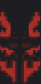

<!DOCTYPE html>>
<html>
    <head>
    </head>
    <link href="style.css" rel="stylesheet">
    <body>
        <h1 style="color:white" align="center">Pluto squad</>
            

            
            
            
            
pluto client still not public and not planing to be also its a wip

              
Pluto bot commands and features:

            
&mute @user - mutes a user

            
&kick @user reason - kicks a user for a reason

            
&ban @user reason - bans a user for a reason

             
&log -logs commands

             
more coming to this site soon, but I am kinda lazy ngl

    </body>
</html>    
